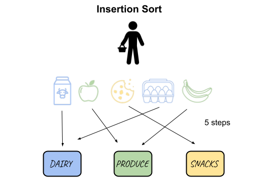
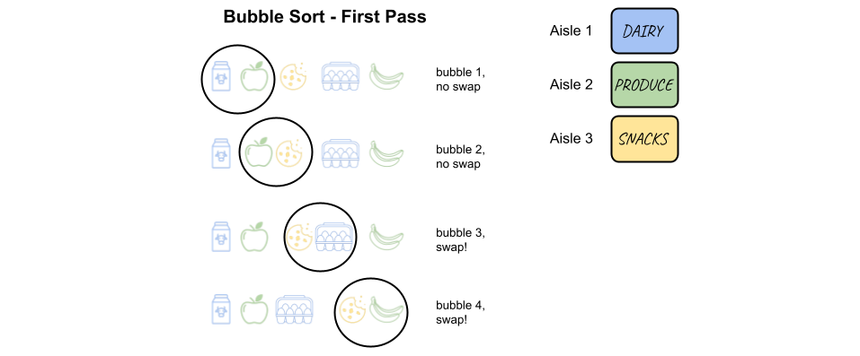
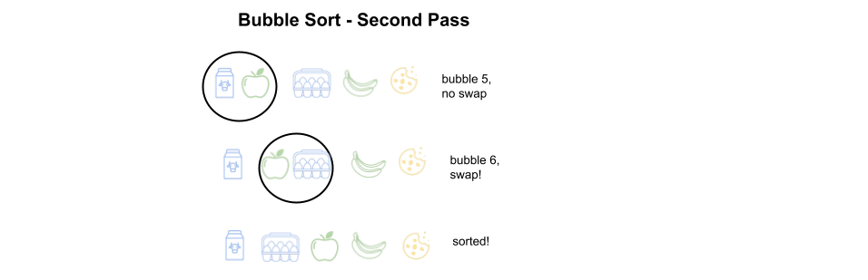
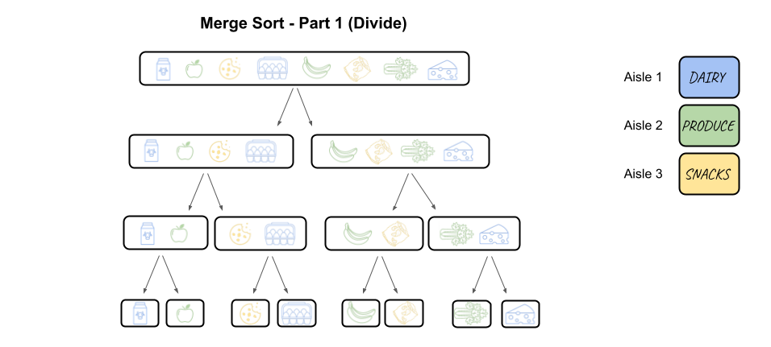
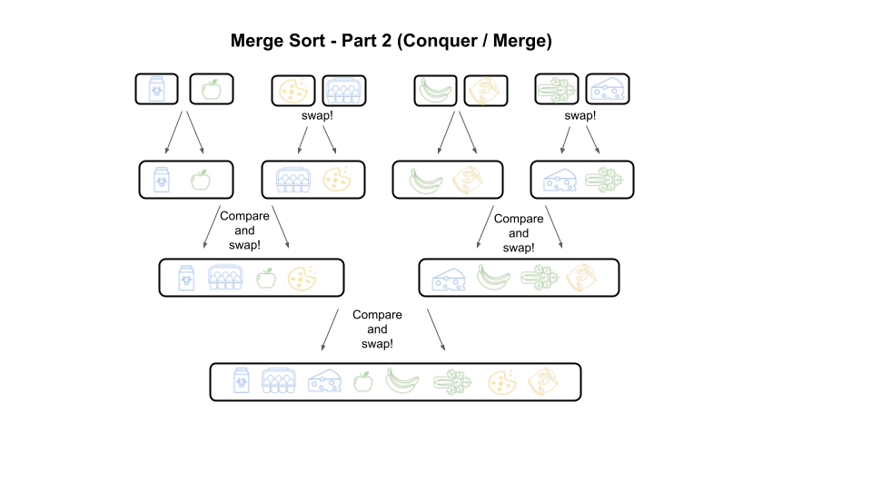

# Sort Your Life Out!

Recently with COVID-19, I’ve found myself looking for ways to decrease my time spent in close physical contact with other humans. I’ve circled in on the fact that the majority of physical interactions these days occur at grocery stores, and in an attempt to help flatten the curve, I’ve come up with a new technique to accelerate your time at the grocery store.

Assuming you are not a barbarian who just walks into a grocery store with no plan, the key to efficient shopping comes from utilizing your grocery list to its maximum potential. Most often when curating a grocery list, people may write what comes to mind and then head to the store to get their goods, item by item.


```python
# For example, if our list is something like this:
grocery_list = ["Milk", "Apples", "Cookies", "Eggs", "Bananas"]

# And our store is split into department aisles as such (department_aisleNumber):
departments = ["Dairy_1", "Produce_2", "Snacks_3"]

# We would need to pick up each item individually.
```



The average grocery shopper would head to the Dairy department to pick up Milk, then to the Produce department to pick up their Apples, onward to the Snacks section to pick up their Cookies, back to the Dairy department to grab their eggs, and finally circle back to the Produce section to pick up their Bananas. 

This type of shopper is using an Insertion Sort technique. Although this does get the job done, just reading how many times they walked back and forth exhausts me, not to mention how many potentially contaminated humans they could have crossed paths with.

The key to maximizing shopping efficiency is to organize your grocery list strategically. Imagine a scenario where we organized that same list by department aisles.


```python
# Original list:
grocery_list = ["Milk", "Apples", "Cookies", "Eggs", "Bananas"]

# Organized list:
grocery_list_organized = ["Milk", "Eggs", "Apples", "Bananas", "Cookies"]

departments = ["Dairy_1", "Produce_2", "Snacks_3"]

# Now we can head to the Dairy aisle and pick up our Milk and Eggs together, head to the 
# Produce aisle and grab our Apples and Bananas, and finally pick up our Cookies in the Snacks section.

# Note: In this grocery example, we can say that items in each department can be interchangeable (i.e. You can pick up Milk first and then Eggs, or Eggs 
# first and then Milk, the time will be the same)
```

This system definitely saves us time, but this means we’ll have to sort our grocery list before getting to the store. Sure we can order our list one by one like an Insertion sorter, but that’s going to take a long time. Have no fear, we can easily optimize our list by borrowing sorting strategies that computer scientists use all the time!

One sorting technique that you may have heard of is called Bubble Sort. This is often used when we sort lineups. For example, doctors sorting an emergency room (ER) lineup from most urgent to least urgent will compare the first two people in the line, determine who is in need of more urgent care, and swap them if they are in the wrong order. The doctor passes through the lineup repeatedly, performing swaps until no more swaps are necessary, indicating the lineup is sorted.

Let's apply Bubble Sort to our grocery list!


```python
# Original list:
grocery_list = ["Milk", "Apples", "Cookies", "Eggs", "Bananas"]
departments = ["Dairy_1", "Produce_2", "Snacks_3"]

# First Pass

# Compare the first two elements: Milk and Apples
# They are in the correct order of aisle 1 before aisle 2
grocery_list = ["Milk", "Apples", "Cookies", "Eggs", "Bananas"]

# Compare the second and third elements: Apples and Cookies
# They are in the correct order of aisle 2 before aisle 3
grocery_list = ["Milk", "Apples", "Cookies", "Eggs", "Bananas"]

# Compare the third and fourth elements: Cookies and Eggs
# Swap since Cookies are in aisle 3 and Eggs are in aisle 1
grocery_list = ["Milk", "Apples", "Eggs", "Cookies", "Bananas"]

# Compare the fourth and fifth elements: Cookies and Bananas
# Swap since Cookies are in aisle 3 and Bananas are in aisle 2
grocery_list = ["Milk", "Apples", "Eggs", "Bananas", "Cookies"]

# Second Pass

# Compare the first two elements: Milk and Apples
# They are in the correct order of aisle 1 before aisle 2
grocery_list = ["Milk", "Apples", "Eggs", "Bananas", "Cookies"]

# Compare the second and third elements: Apples and Cookies
# Swap since Apples are in aisle 2 and Eggs are in aisle 1
grocery_list = ["Milk", "Eggs", "Apples", "Bananas", "Cookies"]

# No more swaps required, we have organized our list!
```





Bubble Sort works great when we have a short list, but let’s say we’re preparing a larger feast. 


```python
# Our list could look something like this:
grocery_list = ["Milk", "Apples", "Cookies", "Eggs", "Bananas", "Chips", "Celery", "Yogurt"]
departments = ["Dairy_1", "Produce_2", "Snacks_3"]
```

In this case, we really must optimize the time it takes for us to grocery shop since not only do we need to minimize shopper interactions at the store, we also need to get home fast to start cooking! This is when faster sorting algorithms can come in handy.

If we think back to that example of a doctor sorting their patients, what if there's a major medical crisis in the ER, maybe due to a global pandemic or something, and there are many patients to sort. That doctor needs to sort patients faster than the two sorting algorithms we just learned (Insertion and Bubble). We can think of a doctor's triage in a divide and conquer strategy. If we divide the lineup of patients in half, we can have one doctor sort the first half and another doctor sort the second half. What's special here, is that we can also have those two doctors divide their halves into halves again and continue dividing up the work until their lineups contain one element only. At this point, the merge process begins, and the doctors can merge their sorted parts together by comparing each element in their two lineups until they have one sorted lineup of patients. Since both of the doctors sorted their halves, we could compare the more urgent patients from both halves, and whoever is more urgent gets put first in the new lineup. We continue this until one half is done, and then we can just put the rest of the other half in the lineup. This strategy is called Merge Sort.

Let's try Merge Sort with our grocery list!


```python
# Original list:
grocery_list = ["Milk", "Apples", "Cookies", "Eggs", "Bananas", "Chips", "Celery", "Yogurt"]
departments = ["Dairy_1", "Produce_2", "Snacks_3"]
```





Merge Sort is definitely faster when we have a longer list of items to sort! Merge Sort actually took fewer steps than if we had sorted each item individually (insertion sort) or if we had compared each pair of items repeatedly (Bubble Sort). This is because when Merge Sort divides the original list into two and repeats, we can easily explore subsets of the list instead of exploring the long list all in one. Finally, merging the parts back together is simplified since the sublists are already sorted.

We have now connected three common search algorithms computer scientists use to our daily lives. There are definitely many more sorting algorithms out there, that use different strategies to sort. More examples include Quick Sort (another common divide and conquer strategy), Heap Sort, and Bucket Sort. We might need a sorting strategy to sort these sorting algorithms...

Anyways, you can now maximize your sorting efficiency! It's interesting to think about all the different scenarios we can find ourselves in when we might need to sort something quickly. Playing cards and needing to sort your hand, cleaning out your closet and having to categorize your clothes, or even organizing your Spotify playlist, the sorting scenarios are endless! 

Godspeed 🚀 
